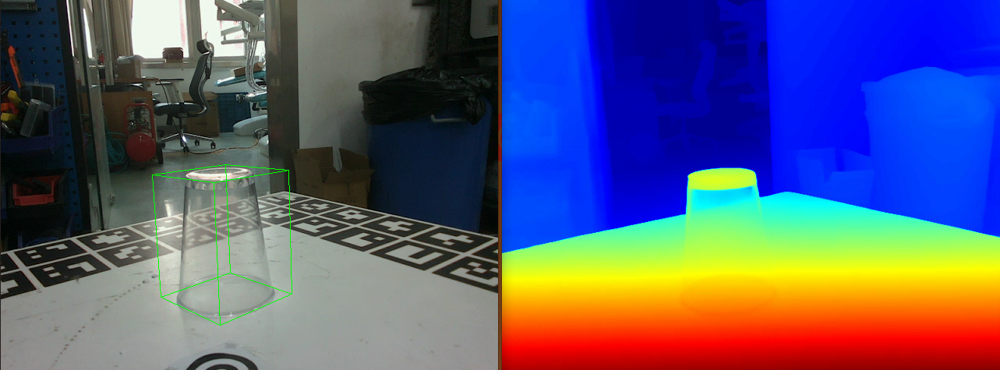
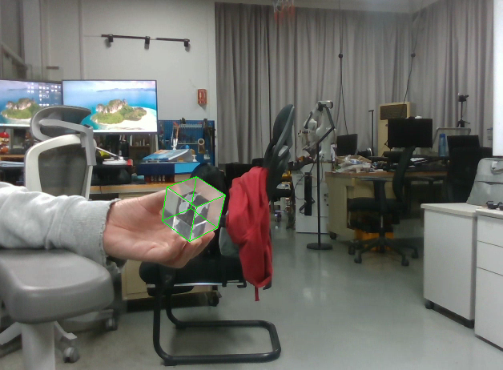

# FoundationPose_RGB
I try to  expand FoundationPose to RGB input. 
The idea is very simple. Firstly, we use the depthanything encoder and OT for template matching to obtain the initial pose. Then use depthanything to obtain depth through RGB image, which is used for the refine section of FoundationPose.

In this way, the FoundationPose can be used by rgb input.

```
Attention!!!!! However, this method is not stable. The performance is inflenced by the background easily. And the 
initial pose is also not stable. 
```




# Installation
It is easy to install this code.

## 1. Install the DepthAnything （Two versions） and GlueStick
- Install the [[FoundationPose]](https://github.com/NVlabs/FoundationPose)
- Install the [[DepthAnything_Tensorrt]](https://blog.csdn.net/qq_39045712/article/details/142857630?ops_request_misc=%257B%2522request%255Fid%2522%253A%25223bd4c1aa3a76c4afa3a9f500bd2c0905%2522%252C%2522scm%2522%253A%252220140713.130102334.pc%255Fall.%2522%257D&request_id=3bd4c1aa3a76c4afa3a9f500bd2c0905&biz_id=0&utm_medium=distribute.pc_search_result.none-task-blog-2~all~first_rank_ecpm_v1~rank_v31_ecpm-2-142857630-null-null.142^v102^pc_search_result_base4&utm_term=depthanything%20V2%20%20tensorrt&spm=1018.2226.3001.4187)
- Install the [[DepthAnything]](https://github.com/LiheYoung/Depth-Anything) and download the Depth-Anything-Large
- Install the OT
```
pip install geomloss
```

# Run the demo

- Run demo 
```
python run_demo_track_rgb_dptV2.py
python run_demo2_track_rgb_dptV2.py
```

- Render the templates, and the templates is saved in "weight/tmp". Then run real time by realsense 
```
python my_render.py 
python run_pose_my_realsense_fast.py
```
